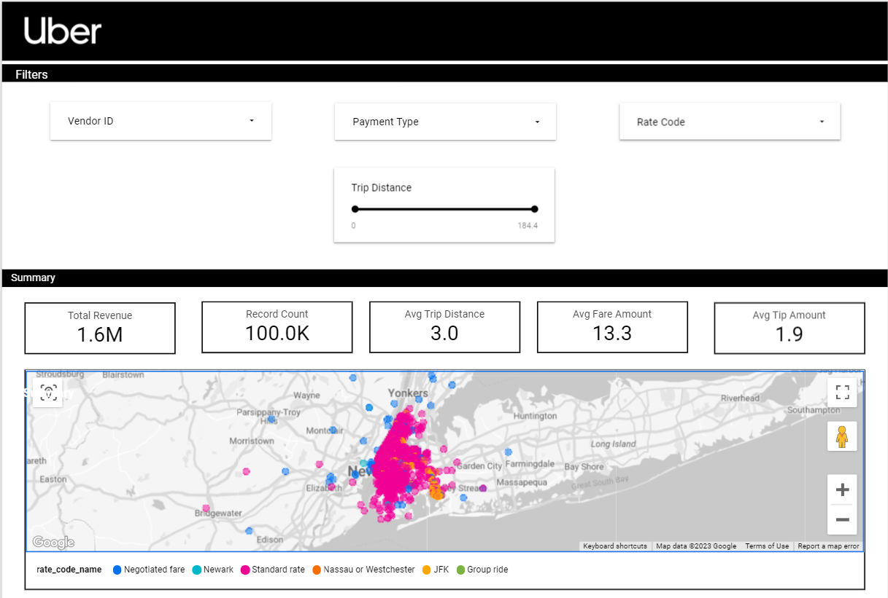
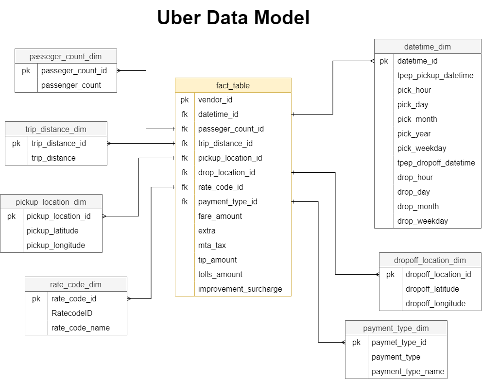

# Uber Data Anaytics | End-To-End Data Engineering Project

## Architecture :

Details :
- Cloud Storage to store the dataset
- Mage tool to do ETL operations
- Big-Query as datawarehouse
- Google Looker for visualizing the data

## Prequisite :
- Basic Python, SQL and jupyter Notebook install
- GCP Service : 
    - Cloud Storage
    - Compute Engine
    - BigQuery
    - Looker
- Mage (Data pipeline tool for transforming and integrating data)

## Fact & Dimension Table
### Fact Table
- Contains quantitative measures or metrics that are used for analysis
- Typically contains foreign keys that link to dimension tables
- Contains columns that have high cardinality and change frequently
- Contains columns that are not useful for analysis by themselves, but are necessary for calculating metrics

### Dimension Table
- Contains columns that describe attributes of the data being analyzed
- Typically contains primary keys that link to fact tables
- Contains columns that have low cardinality and don't change frequently
- Contains columns that can be used for grouping or filtering data for analysis

## Dashboard :

Click picture for details

## Data Modeling 
